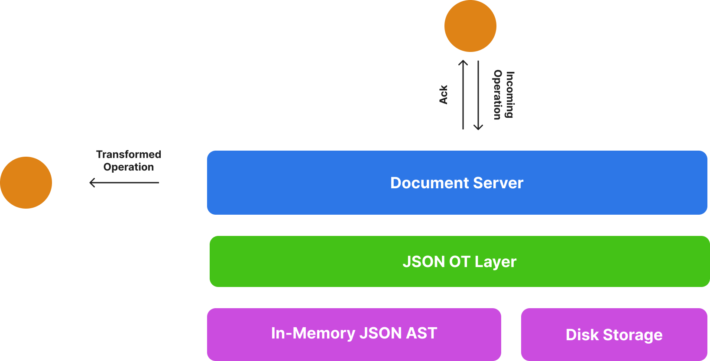

# The Concurrent Editor
As a high level overview though the concurrent editor is an OT based editor thats heavily influenced by Google's Wave algorithm, Wave was Google's predecessor to Google docs and heavily inspired the architecture for Google Docs. Our editor uses the same underlying architecture as Wave except the difference lies in the type of operations we are sending between the server and client. Wave was designed to operate with operations that modified unstructured data, while our operations modify structured JSON data.

Before reading the rest of this document I highly recommend you read through the resources linked in the base [README.md](../../README.md).

## High Level Architecture
At a very high level our editor server consists of 3 distinct layers.
 - **The data layer**
    - This layer is the server's copy of the current state of the document. This layer is what all incoming operations will modify. Our initial design for the data layer involved a singular struct modelling the entire document that we modified using reflection. This proved tricky due to the intricacies of Go's reflection system so we moved to an AST based approach. Currently the data layer is just the AST for the JSON of the document, and operations modify this AST directly. To prevent corrupted documents we have various data integrity checks utilising reflection.
 - **The client layer**
    - The client layer is an internal representation of an active client connection. Whenever a client connects to our server a new client object is allocated to represent their connection.
 - **The document server layer**
    - The server layer is a big object that models a singular document being edited, it maintains a list of all active client objects that are connected to it and the current state of its AST.



## Starting a Document
I personally feel like its rather easy to understand a system if you understand how it achieves its key features. This section is about what exactly happens when a user clicks the "edit" button on a document and constructs an edit session. What type of objects are created? Where do they live? Etc. 

### The connection starts
When the user clicks the "edit" button, this instantiates a HTTP request that's handled by the HTTP handler in `main.go`: `func EditEndpoint(w http.ResponseWriter, r *http.Request)`. This handler takes the incoming request, looks up the requested document and if it exists upgrades the connection to a WebSocket connection. This is important as a WebSocket connection allows for bidirectional communication between the client and server  in real time without needing either to poll for updates

After upgrading the connection to a WebSocket connection the handler then asks the `DocumentServerFactory` to either create or fetch the object modelling an active edit session for the requested document. If the document does not already have an active edit session the `DocumentServerFactory` will proceed to read the document from disk, parse it (convert it from a text file to a go struct) and constructs a `DocumentServer`. This `DocumentServer` is responsible for managing the current state of the document, tracking the clients editing the document, and keeping the history of the operations.

After the `DocumentServer` is created / fetched, a client object is allocated and registered with the document server and a new goroutine is spun up to handle incoming operations from the client. The handler code is as follows (note it is subject to change):
```go
func EditEndpoint(w http.ResponseWriter, r *http.Request) {
	requestedDocument := // parse request body
	targetServer := GetDocumentServerFactoryInstance().FetchDocumentServer(requestedDoc)

	wsClient := newClient(ws)
	commPipe, signalDeparturePipe := targetServer.connectClient(wsClient)

	go wsClient.run(commPipe, signalDeparturePipe)
}
```
During the connection process the document server returned two "pipes". A "pipe" is a function that the client (or at least the client's shadow on the server) can use to propagate messages to the server it is connected to. 

### The client applies an operation
So the client has just applied an operation to their local document, the frontend has captured this and set it to the server via websockets, now what? 😳. If you remember back to the previous code snippet the last bit of code spun up a goroutine to run the `wsClient.run` function, this function is an infinite loop that is constantly reading from the websocket and forwarding the operations to the document server. The `wsClient.run` function at the moment of typing up this document looks something like:
```go
func (c *clientView) run(serverPipe pipe, signalDeparturePipe alertLeaving) {
	for {
		select {
		case <-c.sendOp:
			// push the operation down the websocket
			// send an acknowledgement
			break

		case <-c.sendAcknowledgement:
			// push the acknowledgement down the websocket
			break

		case <-c.sendTerminateSignal:
			// looks like we've been told to terminate by the documentServer
			// propagate this to the client and close this connection
			c.socket.Close()
			return

		default:
			if _, msg, err := c.socket.ReadMessage(); err == nil {
				// push the update to the documentServer
				if request, err := operations.ParseOperation(string(msg)); err == nil {
					serverPipe(request)
				}
			} else {
				// todo: push a terminate signal to the client, also tell the server we're leaving
				signalDeparturePipe()
				c.socket.Close()
			}
		}
	}
}
```
The bit of interest is what happens in the `default` branch of the select statement (we will talk about the other branches later). Within this branch we attempt to read something from the websocket and then parse that (we will cover parsing a little later as its surprisingly complicated), we then use the `serverPipe` mentioned previously to send that request to the document server. 

This `serverPipe` is a closure returned by the `buildClientPipe` method during the connection setup with the `DocumentServer`. The function is relatively intense so a lot of details have been left out here.
```go
func (s *documentServer) buildClientPipe(clientID int, workerWorkHandle chan func(), workerKillHandle chan empty) func(operations.Operation) {
	return func(op operations.Operation) {
		// this could also just be captured from the outer func
		clientState := s.clients[clientID]
		thisClient := clientState.clientView
		
		// ... skipped implementation details

		// spin up a goroutine to push this operation to the server
		// we do this in a goroutine to prevent deadlocking
		go func() {
			defer func() {
				clientState.canSendOps = true
				thisClient.sendAcknowledgement <- empty{}
			}()

			clientState.canSendOps = false

			// apply op to clientView states
			s.stateLock.Lock()

			// apply the operation locally and log the new operation
			transformedOperation := s.transformOperation(op)
			s.operationHistory = append(s.operationHistory, transformedOperation)

			// apply the transformed operation locally (note that this is being applied against the server's state)
			if !transformedOperation.IsNoOp {
				newState, err := op.ApplyTo(s.state)
				if err != nil {
					log.Fatal(err)
					clientState.sendTerminateSignal <- empty{}
				} else {
					s.state = newState
				}
			}

			s.stateLock.Unlock()

			// propagate updates to all connected clients except this one
			// if we send it to this clientView then we may deadlock the server and clientView
			s.clientsLock.Lock()
			for id, connectedClient := range s.clients {
				if id == clientID {
					continue
				}

				// push update
				connectedClient.sendOp <- transformedOperation
			}
			s.clientsLock.Unlock()
		}
	}
}
```
So whenever we get an operation from the client we:
 1. communicate it to the document_server via a pipe
 2. the operation is then transformed against the entire log of operations the server has applied
 3. the operation is then applied to the server's representation of the document
 4. the operation is then communicated to all other clients 

### The document server wants to propagate operations
If you remember previously how it was mentioned that the document server "propagates" operations to the clients? It does that by sending these operations down a channel maintained by each client
```go
type clientView struct {
	socket *websocket.Conn

	sendOp              chan operations.Operation
	sendAcknowledgement chan empty
	sendTerminateSignal chan empty
}
```
`sendOp`, the `wsClient.run` function is constantly listening for messages down these channels and actions on them accordingly.

## Operation Parsing & Application
For information regarding how operation parsing and application works see  document.

## Lock Acquisition Order
To prevent deadlocks we have a defined lock acquisition order for each type, thankfully theres not many as most synchronization is achieved using channels. They are as follows.

`document_server`
 1. document state lock
 2. client lock

`server factory`
 1. active servers lock
