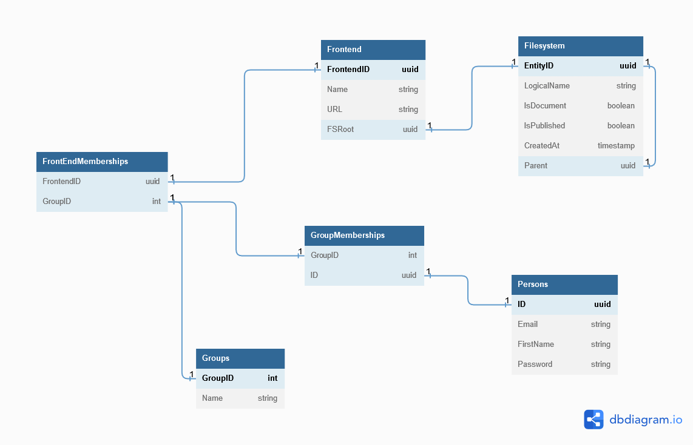

# Database

The database/postgres folder contains everything related to our schema + in house migration system. Before discussing the schema lets talk about the migration mechanism.

## Migrations
In order to prevent old data from being deleted we cannot completely destroy the DB container when we created changes to the DB. As such we must introduce a migration mechanism. Migrations are basically small little scripts that contain patches we want to apply to the DB, when deploying changes we create these migration scripts and tell the migration engine to run the new script. 

### How to do a CMS Migration
If you're introducing a new DB change to the CMS simply create your migration script in `up/version.sql`, then increase the `dbver.txt` number by 1, doing so will introduce your changes to the staging database. Internally the migration engine just deletes and recreates the DB (this is fine for now but in production situations we cannot do this.) In the future we are looking to replace this with a proper migration engine like `sqitch`.

## Schema and Tables
The CMS is composed of a few key tables, these are:
 - The Frontend Table
    - Maintains metadata regarding all frontend clients registered on the CMS (the best way to think of a frontend client is as a website created on the CMS)
 - The Person table
    - User data (as in editors)
 - The Groups table
    - The groups table manages catch all permissions that are applied the users, users can be members of certain groups and will inherit those permissions.
    - There are more details regarding frontend level groups but that PR is still pending at the moment.
 - The Filesystem Table + Metadata Table
    - Models filesystem for every possible frontend, the associated metadata table contains information about each entity within the FS table.

We have produced a small diagram that will hopefully make the DB a little easier to understand. Do not that the diagram is not reflective of teh current state of the DB and is in fact reflective of what it will look like after a few key PRs are finalised.
